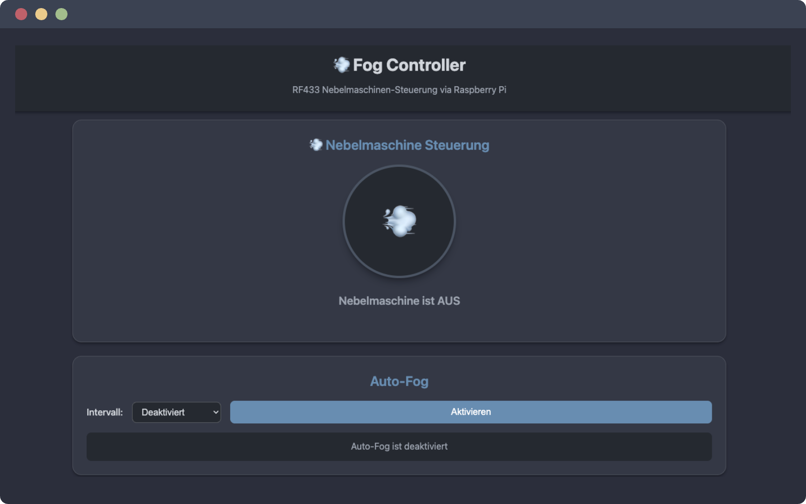

# Fog Controller

[](https://opensource.org/licenses/MIT)
[](https://nodejs.org/)
[](https://www.raspberrypi.org/)
[](https://expressjs.com/)

RF433 fog machine controller for Raspberry Pi with a modern web interface, auto-fog scheduling, and usage analytics.



## Features

- **RF433 Control** - Trigger fog machines over 433 MHz RF signals via GPIO 17
- **Web Interface** - Responsive dark-theme PWA with touch support and fog animation
- **Auto-Fog** - Automatic activation at configurable intervals (2/5/10 min) with 1 h auto-off
- **Usage Analytics** - MySQL-backed 24 h usage history with peak-hour analysis
- **REST API** - Full RESTful API for external integrations
- **PM2 Managed** - Auto-start, monitoring, and crash recovery

## Hardware

| Component | Connection |
|-----------|-----------|
| RF433 Transmitter DATA | GPIO 17 (Pin 11) |
| RF433 VCC | 5 V (Pin 2) |
| RF433 GND | GND (Pin 6) |

## Quick Start

```bash
git clone https://github.com/pepperonas/fog-controller.git
cd fog-controller
npm install
npm start
```

The web interface is available at `http://<pi-ip>:5003`.

## API

| Method | Endpoint | Description |
|--------|----------|-------------|
| `GET` | `/api/health` | Health check |
| `GET` | `/api/status` | Current fog status |
| `POST` | `/api/fog/on` | Turn fog on |
| `POST` | `/api/fog/off` | Turn fog off |
| `POST` | `/api/fog/toggle` | Toggle fog |
| `POST` | `/api/auto-fog/enable` | Enable auto-fog |
| `POST` | `/api/auto-fog/disable` | Disable auto-fog |
| `GET` | `/api/analytics/usage` | Usage analytics |

## Tech Stack

- **Runtime** - Node.js 18+ / Express 4
- **Database** - MySQL (optional, for analytics)
- **Hardware** - RF433 transmitter, Raspberry Pi
- **Process Manager** - PM2

## Author

**Martin Pfeffer** - [celox.io](https://celox.io)

## License

This project is licensed under the MIT License - see the [LICENSE](LICENSE) file for details.
