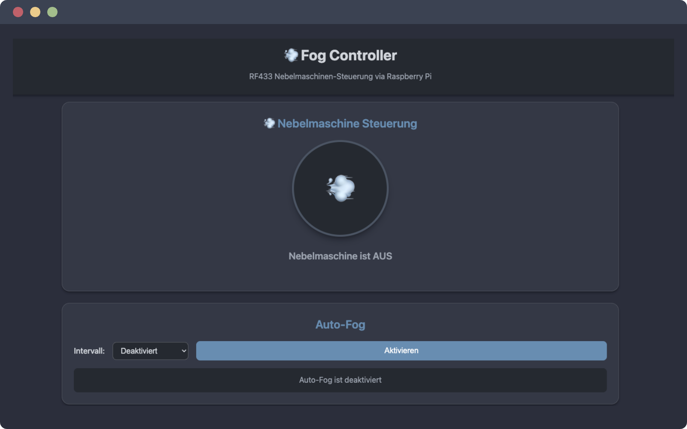

# 💨 Fog Controller

RF433 Nebelmaschinen-Steuerung via Raspberry Pi mit modernem Web-Interface.



## Features

- **RF433 Steuerung**: Kontrolle von Nebelmaschinen über 433MHz RF-Signale
- **Web Interface**: Modernes, responsives Dark-Theme Interface
- **Auto-Fog**: Automatische Aktivierung alle 2/5/10 Minuten mit 1h Auto-Deaktivierung
- **MySQL Integration**: Persistente Speicherung aller Aktivierungen mit Zeitstempel
- **Usage Analytics**: Grafische Darstellung der Nutzung mit Peak-Hour-Analyse
- **Status-Tracking**: Aktivierungszähler und Statistiken
- **PWA-Support**: Installierbar als Progressive Web App
- **API-Endpoints**: RESTful API für Integration
- **PM2 Integration**: Automatischer Start beim Boot

## Hardware Setup

### RF433 Modul Anschluss
- **GPIO 17 (Pin 11)**: RF433 Sender DATA Pin
- **5V (Pin 2/4)**: RF433 VCC
- **GND (Pin 6/9)**: RF433 GND

### RF433 Codes
- **ON Code**: 4543756 (0x455B7C)
- **OFF Code**: 4543792 (0x455B90)
- **Protocol**: 1 (Standard)
- **Pulse Length**: 320 µs
- **Bit Length**: 24 bits

## Installation

```bash
# Repository klonen
git clone <repository-url>
cd fog-controller

# Dependencies installieren
npm install

# MySQL Setup (optional, für Analytics)
mysql -u root -p < setup-database.sql

# Umgebungsvariablen konfigurieren
cp .env.example .env
# Bearbeite .env mit deinen Datenbankdaten

# Starten
sudo npm start
```

## Web Interface

Das Interface ist unter `http://raspberry-pi:5003` erreichbar und bietet:

- **Großer Fog-Button**: Ein-/Ausschalten der Nebelmaschine
- **Auto-Fog**: Automatische Aktivierung alle 2/5/10 Minuten
- **Status-Anzeige**: Visueller Status mit Pulsing-Effekt
- **Usage Analytics**: Grafische Darstellung der Nutzung über 24h
- **Statistiken**: Aktivierungszähler, letzte Aktivierung und Peak-Hour
- **Erweiterte Steuerung**: Separate Ein/Aus-Buttons

## API Endpoints

### Status abfragen
```bash
GET /api/status
```

### Nebelmaschine steuern
```bash
POST /api/fog/on      # Einschalten
POST /api/fog/off     # Ausschalten
POST /api/fog/toggle  # Umschalten
```

### Auto-Fog
```bash
GET /api/auto-fog/status              # Auto-Fog Status
POST /api/auto-fog/enable             # Auto-Fog aktivieren
POST /api/auto-fog/disable            # Auto-Fog deaktivieren
```

### Analytics
```bash
GET /api/analytics/usage              # Nutzungsstatistiken
```

### Statistiken
```bash
POST /api/stats/reset  # Statistiken zurücksetzen
```

## Python Script

Das Python-Script kann auch direkt verwendet werden:

```bash
# Einschalten
sudo python3 fog-controller.py --command on

# Ausschalten
sudo python3 fog-controller.py --command off

# Custom Code senden
sudo python3 fog-controller.py --command custom --code 4543756
```

## PM2 Deployment

```bash
# PM2 starten
npm run pm2:start

# Beim Boot starten
pm2 save
pm2 startup
# Folge den Anweisungen

# Logs anzeigen
npm run pm2:logs
```

## Entwicklung

```bash
# Development Mode mit Auto-Reload
npm run dev

# PM2 Logs
npm run pm2:logs

# PM2 Restart
npm run pm2:restart
```

## Technische Details

### Architektur
- **Frontend**: Vanilla JavaScript, CSS Grid, Dark Theme
- **Backend**: Node.js/Express Server (Port 5003)
- **Hardware**: Python mit RPi.GPIO für RF433-Kommunikation
- **Deployment**: PM2 für Prozess-Management

### RF433 Protokoll
Das System verwendet das RCSwitch-kompatible Protokoll mit:
- LSB-first Übertragung
- 24-bit Codes
- Standard Protocol 1 Timing
- 10x Wiederholung für Zuverlässigkeit

### Sicherheit
- Root-Rechte nur für GPIO-Zugriff erforderlich
- Keine Geheimnisse in der Konfiguration
- CORS-Unterstützung für lokale Entwicklung

## Lizenz

MIT License

## Autor

Martin Pfeffer, 2025 Berlin

---

*Dieses Projekt ist Teil einer Smart-Home-Controller-Suite für Raspberry Pi.*